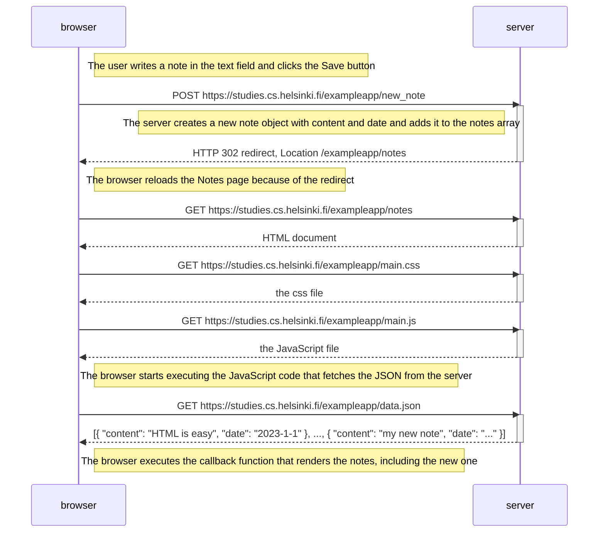
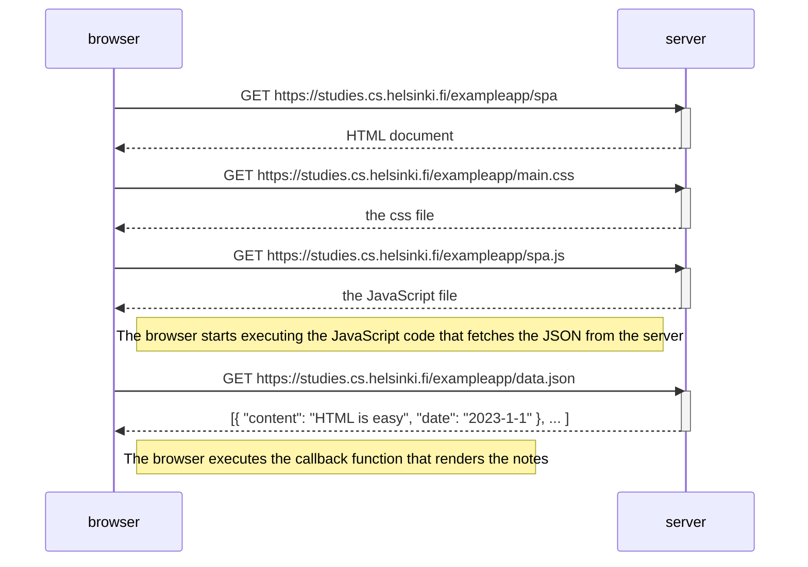
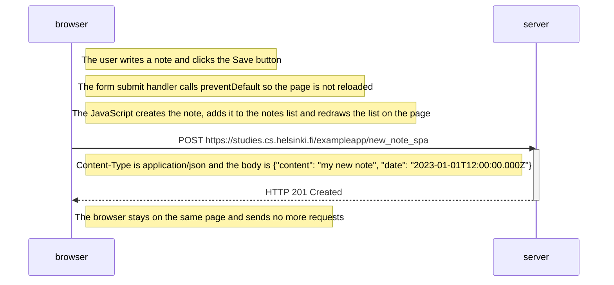

# Part 0

## Exercise num 0.4 

```mermaid
sequenceDiagram
    participant browser
    participant server

    Note right of browser: The user writes a note in the text field and clicks the Save button

    browser->>server: POST https://studies.cs.helsinki.fi/exampleapp/new_note
    activate server
    Note left of server: The server creates a new note object with content and date and adds it to the notes array
    server-->>browser: HTTP 302 redirect, Location /exampleapp/notes
    deactivate server

    Note right of browser: The browser reloads the Notes page because of the redirect

    browser->>server: GET https://studies.cs.helsinki.fi/exampleapp/notes
    activate server
    server-->>browser: HTML document
    deactivate server

    browser->>server: GET https://studies.cs.helsinki.fi/exampleapp/main.css
    activate server
    server-->>browser: the css file
    deactivate server

    browser->>server: GET https://studies.cs.helsinki.fi/exampleapp/main.js
    activate server
    server-->>browser: the JavaScript file
    deactivate server

    Note right of browser: The browser starts executing the JavaScript code that fetches the JSON from the server

    browser->>server: GET https://studies.cs.helsinki.fi/exampleapp/data.json
    activate server
    server-->>browser: [{ "content": "HTML is easy", "date": "2023-1-1" }, ..., { "content": "my new note", "date": "..." }]
    deactivate server

    Note right of browser: The browser executes the callback function that renders the notes, including the new one
```

## Exercise num 0.5

```mermaid
sequenceDiagram
    participant browser
    participant server

    browser->>server: GET https://studies.cs.helsinki.fi/exampleapp/spa
    activate server
    server-->>browser: HTML document
    deactivate server

    browser->>server: GET https://studies.cs.helsinki.fi/exampleapp/main.css
    activate server
    server-->>browser: the css file
    deactivate server

    browser->>server: GET https://studies.cs.helsinki.fi/exampleapp/spa.js
    activate server
    server-->>browser: the JavaScript file
    deactivate server

    Note right of browser: The browser starts executing the JavaScript code that fetches the JSON from the server

    browser->>server: GET https://studies.cs.helsinki.fi/exampleapp/data.json
    activate server
    server-->>browser: [{ "content": "HTML is easy", "date": "2023-1-1" }, ... ]
    deactivate server

    Note right of browser: The browser executes the callback function that renders the notes
```

## Exercise num 0.6

```mermaid
sequenceDiagram
    participant browser
    participant server

    Note right of browser: The user writes a note and clicks the Save button
    Note right of browser: The form submit handler calls preventDefault so the page is not reloaded
    Note right of browser: The JavaScript creates the note, adds it to the notes list and redraws the list on the page

    browser->>server: POST https://studies.cs.helsinki.fi/exampleapp/new_note_spa
    activate server
    Note right of browser: Content-Type is application/json and the body is {"content": "my new note", "date": "2023-01-01T12:00:00.000Z"}
    server-->>browser: HTTP 201 Created
    deactivate server

    Note right of browser: The browser stays on the same page and sends no more requests
```
